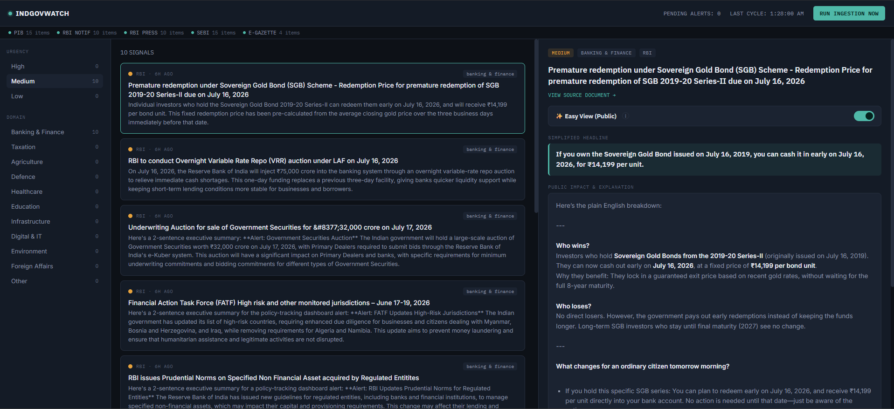

# IndGovWatch

An agentic pipeline that continuously monitors Indian government sources —
PIB, RBI, SEBI, and the e-Gazette — detects new notifications, and uses a
multi-agent LLM pipeline to classify, analyze, and summarize them onto a live
dashboard with a full audit trail.

Every tool in this stack is free and open-source. No paid API, no credit
card, no proprietary service required anywhere in the pipeline.

## What it does

1. **Ingests** new notifications from four official Indian government sources
   on a schedule (or on demand).
2. **Triages** each one with an LLM agent — domain, urgency.
3. **Analyzes impact** with a second agent, grounded by RAG over previously
   seen documents (so it isn't reasoning about each notification in isolation).
4. **Summarizes** it into a plain-English, 2-sentence dashboard alert with a
   third agent.
5. **Logs every step immutably** — both the ingestion outcome per source and
   every agent's input/output — so the whole pipeline is auditable, not a
   black box.
6. **Surfaces it all** on a React dashboard: a filterable signal feed, a
   detail view with the full agent reasoning trail, and a human-in-the-loop
   "mark reviewed" action.
7. **Simplified Public View (Easy View)**: Offers a toggleable "Easy View" showing a jargon-free headline and an everyday citizen impact breakdown explaining who wins, who loses, and daily changes.



## Architecture

```
┌─────────────┐   ┌─────────────┐   ┌──────────────┐   ┌───────────────────────┐   ┌─────────────┐
│  PIB, RBI,  │──▶│  Ingestion  │──▶│  SQLite +    │──▶│  LangGraph agents:    │──▶│  React      │
│  SEBI (RSS) │   │  (APSched-  │   │  Chroma      │   │  1. Triage            │   │  Dashboard  │
│  e-Gazette  │   │  uler tick) │   │  (vector RAG)│   │  2. Impact Analyst    │   │  (FastAPI)  │
│  (scraped)  │   └─────────────┘   └──────────────┘   │  3. Summarizer        │   └─────────────┘
└─────────────┘          │                  │          └───────────────────────┘
                          ▼                  ▼                      │
                  IngestionLog        Regulation row updated  AgentRun audit log
                  (per-source health)  + embedded for future RAG   (per agent step)
```

**Data flow:** the scheduler (or a manual "Run Ingestion Now") triggers a
fetch from each of the four sources → each source's outcome (item count, or
the exact error if it failed) is written to `IngestionLog` → new documents are
deduplicated against `external_id` and stored → any unprocessed document runs
through the three-agent pipeline → results (domain, urgency, summary, impact
analysis) are written back, embedded into Chroma, and logged step-by-step into
an audit table → medium/high urgency items create an `Alert` → the dashboard
polls the API and lets an analyst inspect the full reasoning trail and mark
items reviewed.

## Sources

| Source | How it's fetched | What it covers |
|---|---|---|
| **PIB** (Press Information Bureau) | RSS, discovered dynamically | Official press releases across all central ministries |
| **RBI Notifications** | RSS (`rbi.org.in/notifications_rss.xml`) | Binding regulatory directions — the most compliance-critical feed |
| **RBI Press Releases** | RSS (`rbi.org.in/pressreleases_rss.xml`) | Broader announcements, data releases, monetary policy |
| **SEBI** | RSS (`sebi.gov.in/sebirss.xml`) | Press releases, circulars, and orders/rulings for securities markets |
| **e-Gazette** | Scraped (no RSS/API exists) | Recent Extraordinary Gazette notifications (ministry, subject, gazette ID) |

Four sources, three different levels of reliability — deliberately, because
that's realistic:

- **RBI and SEBI** publish stable, direct RSS URLs. Fetched with a
  browser-like `User-Agent` (several NIC-hosted sites silently reject the
  default Python/`feedparser` UA rather than erroring, which makes a blocked
  request look identical to "no new items" unless you fetch it yourself and
  check the response).
- **PIB** is session-dependent: `ViewRss.aspx?reg=1&lang=1` is not a feed —
  it's an HTML page that *lists* feed links, and hitting the actual feed URL
  cold (no session) gets redirected by PIB's ASP.NET app to different
  parameters than requested. `ingestion/pib.py` handles this by loading the
  landing page first to establish a session, scraping the real feed link out
  of its HTML table, then fetching that link with the same client so the
  session cookies carry over.
- **e-Gazette** has no feed or API at all. `ingestion/egazette.py` parses the
  plain HTML table on its homepage ("Recent Extraordinary Gazettes") instead,
  with a regex-based fallback that scans for the gazette ID pattern directly
  if the table structure ever changes.

All four go through a shared XML/HTML resilience layer
(`ingestion/xml_sanitize.py`) that repairs the most common defect in these
feeds — unescaped `&` characters in titles — before parsing, since strict XML
parsers abort entirely on a single bad token rather than skipping it.

## Ingestion observability

Because "zero new items" can mean either "genuinely nothing new" or "this
source silently failed," every ingestion cycle writes a structured
`IngestionLog` row per source: `ok` + item count, or `error` + the exact
exception message. This is exposed at `GET /ingest/status` and rendered as a
thin health strip under the dashboard's top bar — a green or red dot per
source, with the error visible on hover. If a source goes quiet, you'll see
it immediately instead of having to check server logs.

## The agent pipeline

Specialist agents execute in parallel using a **LangGraph graph** workflow (rather than a single linear prompt) for maximum modularity and concurrency:

- **Triage** — Classifies domain and urgency (low/medium/high).
- **Parallel Track Orchestration**:
  - **Technical Track**: `Impact Analyst` (queries Chroma RAG for past document context) -> `Summarizer` (condenses technical actions).
  - **Public Translation Track**: `Citizen Impact Agent` (jargon-free explanation of winners, losers, and next-day changes) + `Layman Explainer Agent` (catchy lay headline).
- **Join**: Merges outputs from both tracks cleanly.

Every step's input and output is persisted to `AgentRun` — an immutable audit
record of exactly what each agent saw and said, viewable per-document in the
dashboard's detail panel. Medium/high urgency automatically creates an
`Alert`, but a human still has to acknowledge or mark it reviewed —
human-in-the-loop by design, not automation all the way down.

## Free tools used (nothing to pay for)

| Layer | Tool | Why it's free |
|---|---|---|
| Data sources | PIB, RBI, SEBI RSS + e-Gazette scrape | All public, no key required |
| Database | SQLite | Zero setup, file-based |
| Vector store | Chroma (embedded) + sentence-transformers | Runs locally, no server |
| Orchestration | APScheduler (in-process) | No extra infra; swap for Airflow later if you want |
| LLM | Groq free API **or** Ollama (fully local) | Groq: free key, no card. Ollama: 100% offline |
| Backend | FastAPI | Open-source |
| Frontend | React + Vite | Open-source |

## Setup

### 1. Get a free LLM

**Option A — Groq (recommended, fastest to start):**
1. Sign up free at https://console.groq.com (no credit card).
2. Create an API key.
3. Put it in `backend/.env` as `GROQ_API_KEY=...`.

**Option B — Ollama (fully local, zero API calls):**
1. Install from https://ollama.com
2. Run `ollama pull llama3.1`
3. In `backend/.env` set `LLM_PROVIDER=ollama`

**Option C — Nvidia NIM (DeepSeek v4 Pro, fully free):**
1. Sign up at https://integrate.api.nvidia.com
2. Generate a free API key.
3. In `backend/.env` set:
   ```bash
   LLM_PROVIDER=nvidia
   NVIDIA_API_KEY=nvapi-your-key
   NVIDIA_MODEL=deepseek-ai/deepseek-v4-pro
   ```

### 2. Configure environment

```bash
cd backend
cp .env.example .env
# edit .env with your Groq key (or set LLM_PROVIDER=ollama)
```

### 3a. Run with Docker (simplest)

```bash
docker compose up --build
```
- Backend: http://localhost:8000
- Frontend: http://localhost:5173
- API docs: http://localhost:8000/docs

### 3b. Run without Docker

**Prerequisites**
- Python 3.11+ (`python3 --version`)
- Node.js 20+ and npm (`node --version`)
- Two terminal windows/tabs — backend and frontend run as separate processes

**Backend**

```bash
cd backend

# Create and activate a virtual environment
python3 -m venv venv
source venv/bin/activate          # Windows: venv\Scripts\activate

# Install dependencies
pip install -r requirements.txt

# Make sure .env exists (see step 2 above if you haven't done this yet)
cp .env.example .env               # skip if already created

# Start the API server
uvicorn app.main:app --reload --host 0.0.0.0 --port 8000
```

On first run, `sentence-transformers` will download the embedding model
(`all-MiniLM-L6-v2`, a few hundred MB) — this happens once and is cached
locally afterward. SQLite (`indgovwatch.db`) and the Chroma store
(`chroma_data_india/`) are created automatically in `backend/` on first
request; nothing else to provision.

Leave this terminal running. Confirm it's up at http://localhost:8000/health
(should return `{"status": "ok"}`) or the interactive docs at
http://localhost:8000/docs.

**Frontend** (in a second terminal)

```bash
cd frontend
npm install
npm run dev
```

This starts Vite's dev server at http://localhost:5173. It's already
configured to talk to the backend at `http://localhost:8000` via
`VITE_API_URL` — no extra setup needed if you're running both on default ports.

**Common issues running without Docker**

- **`ModuleNotFoundError` for `lxml` or build failures installing it** — `lxml`
  needs system build tools on some platforms. On Debian/Ubuntu:
  `sudo apt-get install python3-dev libxml2-dev libxslt-dev`. On macOS with
  Homebrew, this is usually unnecessary (wheels are prebuilt); on Windows,
  installing via `pip` normally pulls a prebuilt wheel too.
- **Port already in use** — change the backend port with
  `--port 8001` (and update `VITE_API_URL` in `frontend/vite.config.js` or a
  `frontend/.env` to match), or stop whatever else is bound to 8000/5173.
- **CORS errors in the browser console** — check `FRONTEND_ORIGIN` in
  `backend/.env` matches the URL you're actually loading the frontend from.
- **Groq `401`/`invalid API key`** — double-check `GROQ_API_KEY` in
  `backend/.env` has no quotes or trailing whitespace around it.

### 4. Trigger your first ingestion cycle

The scheduler runs automatically every 6 hours (configurable via
`INGESTION_INTERVAL_MINUTES`), but for a first run, just click
**"Run Ingestion Now"** in the dashboard top bar, or:

```bash
curl -X POST http://localhost:8000/ingest/run
```

Watch the health strip populate first — that tells you immediately whether
each source succeeded — then watch new signals populate the feed as the agent
pipeline processes them.

## Known limitations

- **PIB and e-Gazette depend on page markup**, not a stable API contract. If
  NIC changes either site's HTML structure, those two modules are the first
  place to check — they're isolated in their own files specifically so a
  break in one can't take down the other three sources.
- **e-Gazette's listing is homepage-only.** Its full search interface is a
  session-based ASP.NET postback form that isn't scrape-friendly; this
  project only pulls the "Recent Extraordinary Gazettes" list, not historical
  or category-filtered results.
- **Free LLM tiers have rate limits.** Groq's free tier is generous but not
  unlimited — if you point this at all four sources on a short interval with
  a lot of backlog, you may hit rate limits during the initial catch-up run.

## Project structure

```
indgovwatch/
├── backend/
│   ├── app/
│   │   ├── ingestion/
│   │   │   ├── pib.py          # session-based discovery + fetch
│   │   │   ├── rbi.py          # direct RSS
│   │   │   ├── sebi.py         # direct RSS
│   │   │   ├── egazette.py     # HTML table scrape + regex fallback
│   │   │   └── xml_sanitize.py # shared malformed-feed recovery
│   │   ├── agents/
│   │   │   ├── graph.py        # LangGraph 3-agent pipeline
│   │   │   └── llm.py          # Groq/Ollama swap
│   │   ├── routers/
│   │   │   ├── regulations.py  # feed, detail, audit trail, review
│   │   │   ├── alerts.py       # alert list + acknowledge
│   │   │   └── ingest.py       # manual trigger + /ingest/status
│   │   ├── models.py           # Regulation, AgentRun, Alert, IngestionLog
│   │   ├── vectorstore.py      # Chroma embedded RAG store
│   │   ├── pipeline.py         # orchestrates ingestion + agents
│   │   ├── scheduler.py        # APScheduler periodic job
│   │   ├── config.py
│   │   └── main.py
│   └── requirements.txt
├── frontend/
│   └── src/
│       ├── components/
│       │   ├── TopBar.jsx
│       │   ├── SourceHealth.jsx  # per-source ingestion health strip
│       │   ├── Sidebar.jsx
│       │   ├── SignalFeed.jsx
│       │   └── DetailPanel.jsx   # summary, impact analysis, audit trail
│       ├── App.jsx
│       └── api.js
└── docker-compose.yml
```

## Extending further

- **More PIB coverage** — the landing page also lists Media Invitation and
  Photos feeds, and ministry-specific feeds exist via the `reg=` parameter
  (plus a Hindi feed via `lang=2`) if you want more granular per-ministry
  ingestion instead of relying on the triage agent to split one combined feed.
- **State government portals** — most don't have RSS; treat each as its own
  scraping module following the `egazette.py` pattern.
- **Postgres** instead of SQLite for concurrent writes at scale.
- **Airflow** instead of APScheduler for production-grade orchestration —
  the DAG would just call `app.pipeline.ingest_new_documents` /
  `process_unprocessed`, no changes needed elsewhere.
- **Kafka** if you want push-based, near-real-time ingestion instead of
  scheduled polling.
- **A Compliance-Check agent** as a fourth LangGraph node that cross-references
  your own policy documents (also RAG'd from Chroma) to flag direct conflicts.
- **Terraform + a cloud free-tier deployment**, and **Prometheus/Grafana** on
  top of the `IngestionLog`/`AgentRun` tables for pipeline health monitoring —
  both good crossover into DevOps territory if you want to take this further.
